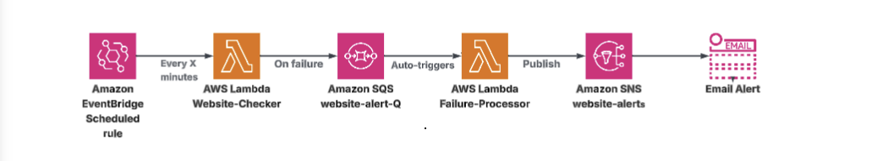
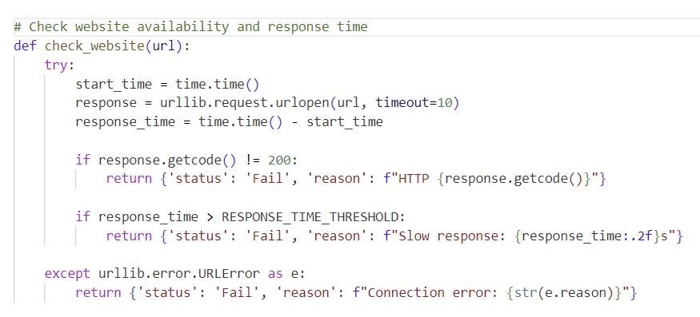
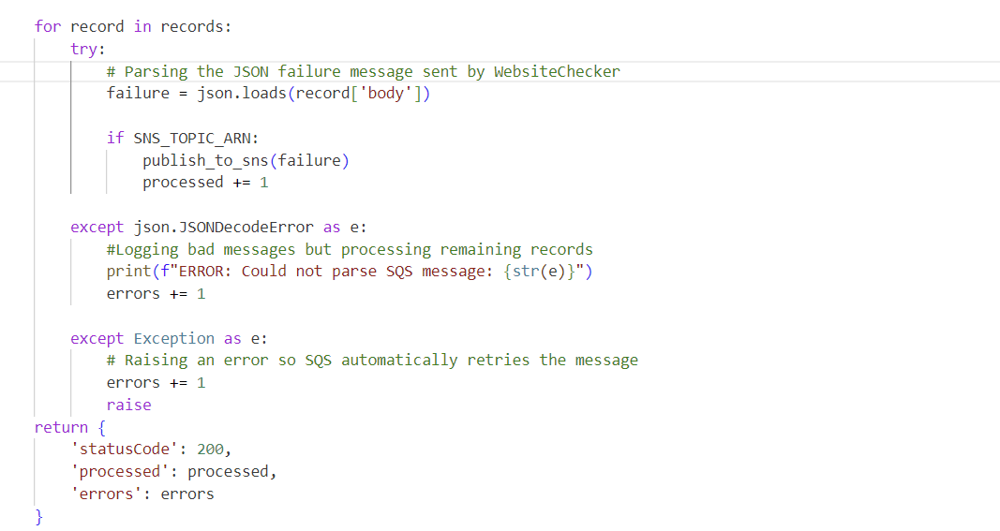
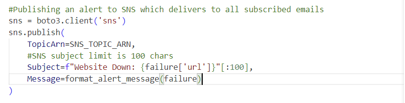
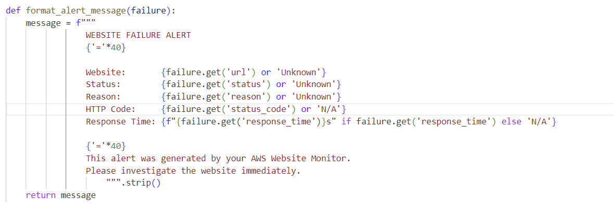
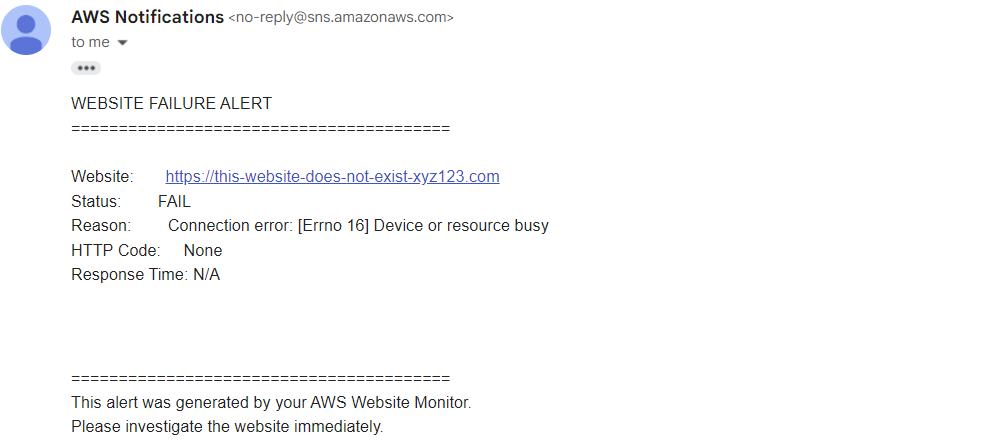

# Website-Monitoring-System
Website downtime costs businesses thousands of dollars per minute. 
This project implements a fully automated, serverless website monitoring system on AWS that detects failures in under 5 minutes, configurable to as low as 1 minute, and immediately alerts stakeholders, ensuring teams can respond before losses escalate

# Technologies used
Python, AWS Lambda, Amazon SQS, Amazon SNS, Amazon EventBridge, IAM, CloudWatch, boto3

# Architecture Diagram

# Code

# Results
## Email Alert

